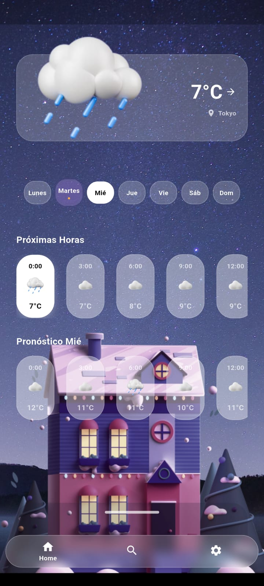
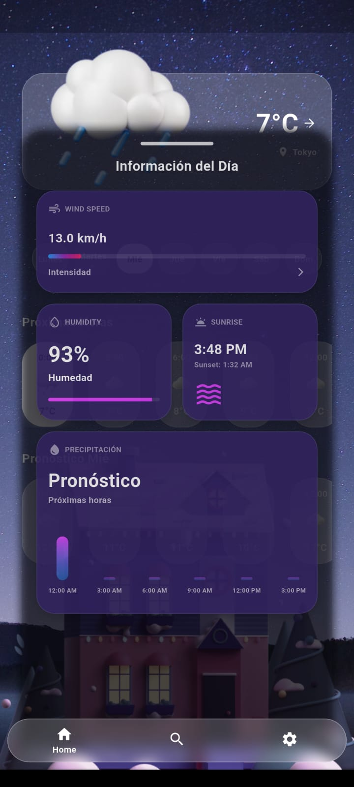
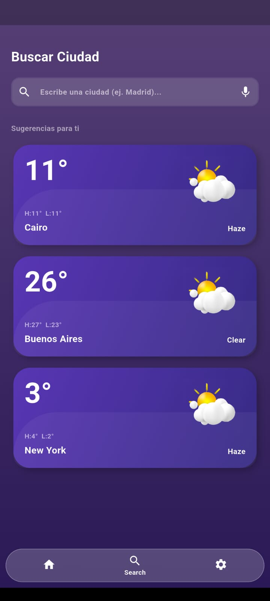
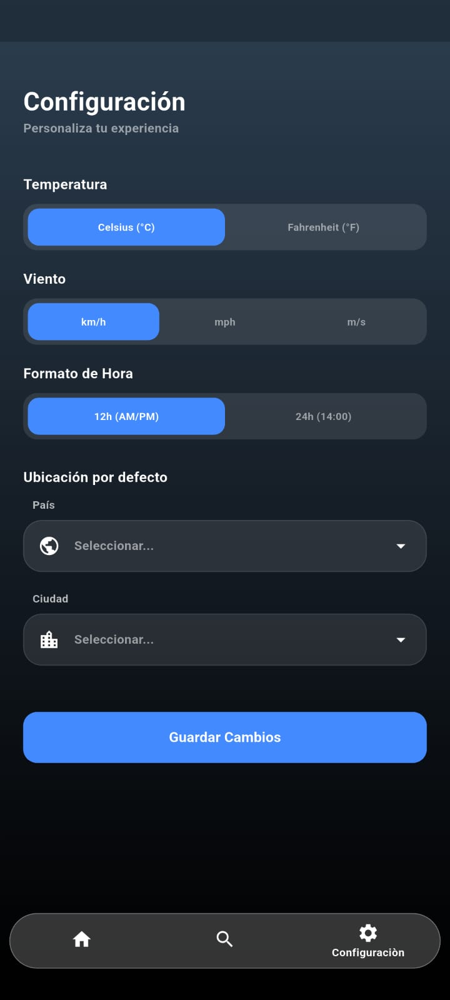

# NovaWeather

Un nuevo proyecto creado con Flutter

## Imagenes de Ilustraciòn

  
  
  <h4>En la primera imagen se muesta el contenido al abrir la aplicacion</h4>
  
  <h4>En este Draggable Menu se encuentra en la primera pagina, donde se puede deslizar para mostrar, en cual se encontrara màs informaciòn del clima</h4>
  
  <h4>Se encontrara una pagina para buscar los paises que quiera el usuario</h4>
  
  <h4>Se puede configurar el Pais y Ciudad por defecto y algunas configuraciones para el usuario</h4>
  

